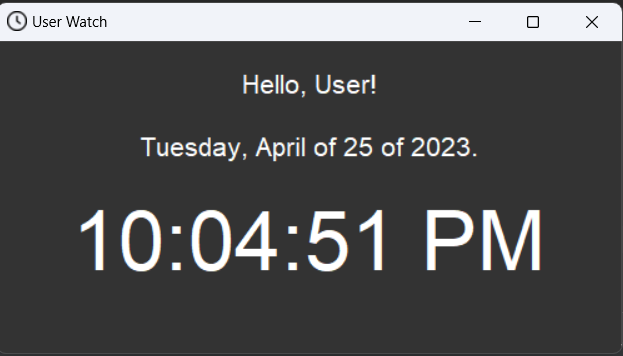

# Relógio pessoal

Na óptica do utilizador não há nenhum comando de entrada de dados, apenas a saída de informações relacionadas ao tempo.

A parte legal desse programa é que temos um relógio de alteração autônoma. Exemplo em image:

